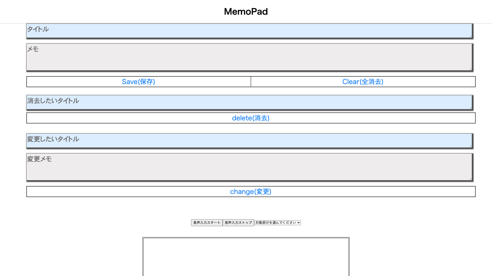

# メモパッドを作成しました（制作期間1.5日）。

ローカルストレージを使用した、メモパッドアプリを作成しました。

https://tealimpala23.sakura.ne.jp/memo_NIWA_24/index.html

###### 画面キャプチャ

## 使用技術

html、css、jquery、javascript、音声認識API

## 工夫した点

・音声認識APIを使用したこと

・canvasを使用したこと

・canvasで描いた絵を、ローカルストレージに保存し、ブラウザ上で表示させたこと

